# CandiCode

Custom pipeline + native OpenCode integration to run a multi-phase software-engineering workflow (`ingress_guard -> budget_envelope -> intent -> triage -> router_gate -> requirements -> requirements_gate -> versioning -> plan -> code -> test -> ci_gate -> security_gate -> qa_perf_gate -> review -> reviewer_gate -> docs -> execute -> verify -> human_checkpoints -> waiver_gate -> gate_pre_merge -> release_rollout -> deploy_runner -> health_gate -> platform_health_gate -> dr_gate -> access_gate -> finalize`).

```mermaid
flowchart TD
  A["Human: Open opencode"] --> B["Local: Bootstrap + policy-as-code + runtime assertions"]
  B --> C["Human: Submit prompt"]
  C --> D["Local Ingress Guard: sanitize + taint-track untrusted context + secret redaction"]
  D --> E["Local Supervisor: queue + budget envelope (tokens/tools/time)"]

  E --> EI["LLM Intent Agent: repo-aware rewrite + target_files/proposed_new_files (Implemented)"]
  EI --> EIG{"Local Intent Resolution Gate: resolve/ambiguous/missing paths (Implemented)"}
  EIG -->|Ambiguous/Missing| K
  EIG -->|Resolved| F["LLM Triage/Router: classify task + confidence score"]

  F --> G{"Local Gate: router confidence >= threshold?"}
  G -->|No| H["Local Fail-safe: deeper pipeline or human triage required"]
  G -->|Yes| I["LLM Requirements Agent: criteria/non-goals/open questions"]
  H --> I

  I --> J{"Local Gate: requirements clear?"}
  J -->|No| K["Human: structured clarification/approval"]
  K --> D
  J -->|Yes| L["Local Versioning Agent: create codex/task branch"]

  L --> M["LLM Planner: execution/risk/test/security plan"]
  M --> N["LLM Coder: minimal diff + strict file_edits/target_files enforcement (Implemented)"]
  N --> O["Local Tool Runner: apply file_edits via repo.write/repo.search (new-file guard; basename resolve) (Implemented)"]
  O --> P["LLM Test Agent: generate/update tests"]
  P --> Q["Local CI: deterministic gate suite + flaky governance"]
  Q --> R{"Local Gate: CI pass?"}
  R -->|No| S["LLM Repair Loop: diagnose/fix"]
  S --> O

  R -->|Yes| T["LLM Security Agent: threat/privacy review"]
  T --> U["Local Security: continuous scans + artifact signing"]
  U --> V{"Local Gate: security pass?"}
  V -->|No| S

  V -->|Yes| W["LLM QA/Perf Agents: matrix + budget checks"]
  W --> X["Local QA/Perf: env matrix + regression budgets"]
  X --> Y{"Local Gate: QA/Perf pass?"}
  Y -->|No| S

  Y -->|Yes| Z["LLM Reviewer: regression/risk findings"]
  Z --> ZA{"Local Gate: reviewer pass?"}
  ZA -->|No| S

  ZA -->|Yes| ZB["Local State Manager: versioned state + invalidation/replay"]
  ZB --> ZC["Local Versioning: PR + provenance bundle"]

  ZC --> ZD{"Local Gate: policy waiver needed?"}
  ZD -->|Yes| ZE["Human: approve waiver (reason/owner/expiry)"]
  ZE --> ZF["Local: immutable waiver log + follow-up task"]
  ZD -->|No| ZG["Human: structured merge approval"]
  ZF --> ZG
  ZG -->|No| S
  ZG -->|Yes| ZH["Local: protected merge to main"]

  ZH --> ZI["Local Release: staged dev->staging->prod + canary"]
  ZI --> ZJ{"Human: prod approval required?"}
  ZJ -->|Yes| ZK["Human: approve rollout"]
  ZJ -->|No| ZL["Local Deploy Runner: execute rollout"]
  ZK --> ZL

  ZL --> ZM["Local Observability: golden signals + synthetic checks + SLOs"]
  ZM --> ZN{"Local Gate: healthy?"}
  ZN -->|No| ZO["Local: auto rollback + incident + postmortem seed"]
  ZN -->|Yes| ZP["Local Audit: immutable end-to-end trail"]

  ZO --> ZP
  ZP --> ZQ["Local Platform Health: eval harness + drift + router accuracy + queue backlog"]
  ZQ --> ZR{"Local Gate: platform healthy?"}
  ZR -->|No| ZS["Local Safe Mode: disable risky automation"]
  ZR -->|Yes| ZT["Human: next prompt"]
  ZS --> ZT

  ZT --> ZU["Local DR Control: backup/restore verification (RTO/RPO checks)"]
  ZU --> ZV{"Local Gate: DR pass?"}
  ZV -->|No| ZW["Human: incident command + recovery approval"]
  ZW --> ZX["Local: run recovery playbook"]
  ZV -->|Yes| ZY["Local Access Governance: RBAC/least-privilege recertification"]
  ZX --> ZY
  ZY --> ZZ{"Local Gate: access policy compliant?"}
  ZZ -->|No| ZW
  ZZ -->|Yes| D

  %% Extra implemented bridge pieces
  C --> BR1["Local Native Bridge: /model provider+model+auth/baseURL -> external pipeline env (Implemented via patched OpenCode core)"]
  BR1 --> E
  ZB --> ST1["Local Runtime State: .opencode-pipeline/state.json persisted per workspace (Implemented)"]

  classDef human fill:#FDE68A,stroke:#92400E,color:#111827,stroke-width:1px;
  classDef local fill:#BFDBFE,stroke:#1E3A8A,color:#111827,stroke-width:1px;
  classDef llm fill:#C7F9CC,stroke:#166534,color:#111827,stroke-width:1px;

  class A,C,K,ZE,ZG,ZJ,ZK,ZT,ZW human;
  class B,D,E,G,H,J,L,O,Q,R,U,V,X,Y,ZA,ZB,ZC,ZD,ZF,ZH,ZI,ZL,ZM,ZN,ZO,ZP,ZQ,ZR,ZS,ZU,ZV,ZX,ZY,ZZ,BR1,ST1,EIG local;
  class F,I,M,N,P,S,T,W,Z,EI llm;

  classDef implemented stroke:#166534,stroke-width:3px;
  classDef planned stroke:#9CA3AF,stroke-dasharray: 6 4,stroke-width:2px;

  class EI,EIG,N,O,BR1,ST1,D,E,G,H,J,Q,R,U,V,X,Y,ZA,ZB,ZD,ZF,ZI,ZL,ZM,ZN,ZQ,ZR,ZS,ZU,ZV,ZY,ZZ implemented;
  class B,F,I,K,L,M,P,S,T,W,Z,ZC,ZE,ZG,ZH,ZJ,ZK,ZO,ZP,ZT,ZW,ZX planned;

```



## Current Implementation Status

- End-to-end local pipeline phases implemented through Step 14 (closed loop):
  - ingress + trust controls (`ingress_guard`)
  - budget assignment/enforcement (`budget_envelope`)
  - intent resolution and strict edit enforcement
  - routing confidence gate (`router_gate`)
  - requirements clarity gate (`requirements_gate`)
  - deterministic CI gate with flaky governance (`ci_gate`)
  - security gate (`security_gate`)
  - QA/perf gate (`qa_perf_gate`)
  - reviewer gate (`reviewer_gate`)
  - state snapshots + replay invalidation + provenance metadata
  - waiver gate + immutable waiver logging (`waiver_gate`)
  - staged rollout/deploy/health with auto rollback
  - platform health, DR, and access governance gates

- Step 14 close-loop validation (full repository test suite):
  - Command:
    - `python3 -m unittest discover -s tests -p "test_*.py" -v`
  - Result:
    - `Ran 112 tests ... OK`


This repo **does not vendor** OpenCode core.  
Instead, it includes a patch file for upstream OpenCode:

- `patches/opencode-core-custom.patch`

## Security

- Do **not** commit credentials or auth files.
- This repo ignores runtime/auth-local artifacts via `.gitignore`.
- Keep provider auth in OpenCode auth storage (`opencode auth ...`) or local env at runtime only.

## Quick Setup

1. Clone this repo.
2. Clone OpenCode core separately.
3. Apply the patch.
4. Build OpenCode core.
5. Point `candicode` command to the patched binary + this pipeline entrypoint.

### 1) Clone

```bash
git clone https://github.com/0202alcc/candicode.git
cd candicode
```

### 2) Clone OpenCode Core

```bash
git clone https://github.com/anomalyco/opencode.git opencode-core
```

### 3) Apply Patch

```bash
git -C opencode-core apply ../patches/opencode-core-custom.patch
```

### 4) Build OpenCode Core

```bash
cd opencode-core/packages/opencode
PATH="$HOME/.bun/bin:$PATH" ~/.bun/bin/bun run build
cd ../../..
```

### 5) Shell Command (`candicode`)

Add this to your shell rc (`~/.zshrc` / `~/.bashrc`):

```bash
candicode() {
  OPENCODE_BIN_PATH="/absolute/path/to/candicode/opencode-core/packages/opencode/dist/opencode-darwin-arm64/bin/opencode" \
  OPENCODE_PIPELINE_ENTRYPOINT="/absolute/path/to/candicode/scripts/opencode_entrypoint.py" \
  opencode "$@"
}
```

Notes:
- Adjust binary path for your platform (`darwin-arm64`, `linux-x64`, etc).
- Keep `opencode` unmodified; use `candicode` for patched flow.

## Python Environment (uv)

`uv` is recommended for cross-platform consistency, even though current dependencies are minimal.

```bash
uv sync
uv run python3 -m unittest discover -s tests -p "test_*.py" -v
```

## Docker (optional)

Docker is useful for running tests consistently in CI, but not for interactive local OpenCode TUI workflows.

```bash
docker build -t candicode .
docker run --rm candicode
```

## Using Provider Mode

- `/model` in OpenCode should select provider/model.
- `opencode auth <provider>` should manage credentials.
- This pipeline receives provider/model/credentials via native integration bridge.

## Useful Commands

```bash
python3 scripts/opencode_entrypoint.py "Fix parser edge case" --model-client auto
python3 scripts/validate_backend_contract_v1.py
python3 scripts/run_pipeline_scenarios.py
python3 -m unittest discover -s tests -p "test_*.py" -v
```
